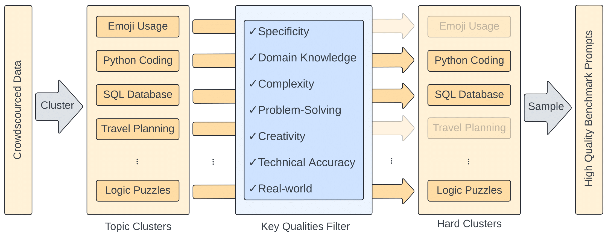

## BenchBuilder
An automatic pipeline to create high-quality benchmark. BenchBuilder was used on Chatbot Arena data to curate Arena-Hard-v0.1.

Checkout our [paper](https://arxiv.org/abs/2406.11939) for more details.



BenchBuilder employs a two stage pipeline.

First, install the BenchBuilder dependencies:
```console
cd BenchBuilder
pip install -r requirements.txt
```

Step 1: annotate the prompt using GPT-3.5-Turbo and filter prompts which either have a score < 5 or belong to a topic cluster with a mean score < 3. This serves as a cheap and first pass through to remove any low quality prompts and clusters before further curation. 

Step 2: use GPT-4-Turbo to annotate the remaining prompts, then extract prompts with quality score of >= 6 and belong to a topic cluster with mean quality score >= 6, ensuring only high-quality prompts are selected with minimal false positives.

After BenchBuilder, we stratified sampled multiple prompts per cluster to create a benchmark. However, you may employ whatever sampling scheme on prompts produced by BenchBuilder.

For Chatbot Arena Category Hard Prompts, which also employed BenchBuilder, we used Llama-3-70B-Instruct as LLM annotators. Check out our Category Hard Prompt [blogpost](https://lmsys.org/blog/2024-05-17-category-hard/) for more detail.

To topic cluster your dataset:
```console
python topic_clustering.py --conv-file [your json file] --min-topic-size 8
```

To annotate your dataset with key criteria:
```console
python label.py --config config.yaml
```
Make sure to properly configure your `config.yaml` before begin labeling.

To filter prompts based on scores and cluster thresholds:
```console
python filter.py --conversations_file [your jsonl file] --clusters_file [your json file] --prompt_threshold 6 --cluster_threshold 3
```

We also employ BenchBuilder on [allenai/WildChat-1M](https://huggingface.co/datasets/allenai/WildChat-1M) and produce 250 high-quality prompts, Wild-Hard-250. We evaluate 10 of the 20 models outlined in the paper on Wild-Hard-250 and a random sample of 250 prompts from Wild-Chat dataset using GPT-4-Turbo as judge.

|    | Wild-Hard-250 | Wild-Chat-Random
| --- | ---- | ----
| Spearman Correlation |	93.6	|		38.2
| Kendall Tau |	85.5	|		27.3