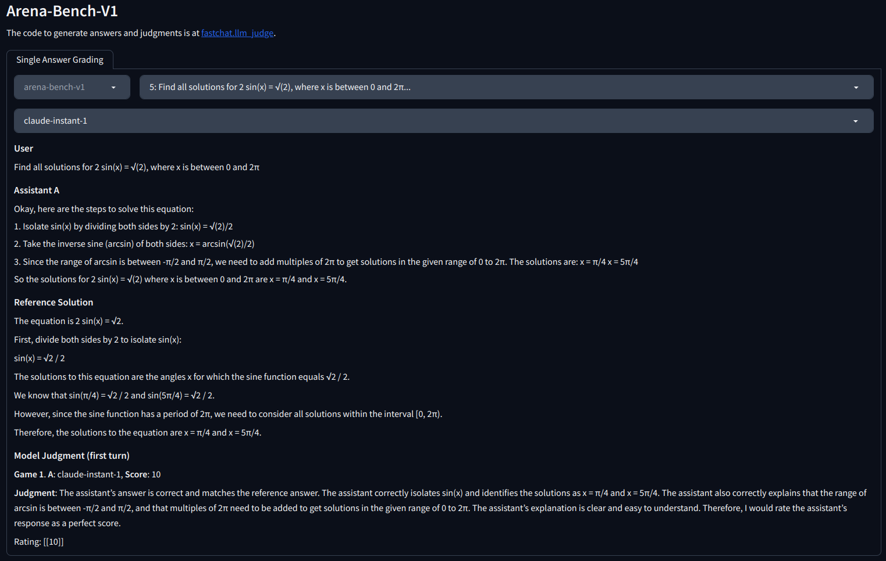

# Arena-Bench-V1
World's Hardest LLM Benchmark! 

### Install FastChat
Install FastChat to enable model/api answer generation and evaluation. Everything after this point will require FastChat to run.
```console
pip install "fschat[model_worker,webui]"
```
For more regarding FastChat, please check out [github.com/lm-sys/FastChat](https://github.com/lm-sys/FastChat).

### Evaluate models using arena-bench-v1:
To generate model answers using FastChat. For more about `gen_api_answer`, please refer to FastChat.
Specify the number of concurrent api calls using argument `--parallel` to distribute api calls across different parallel workers.
```console
python -m fastchat.llm_judge.gen_api_answer \
      --bench-name arena-bench-v1 \
      --model [insert model name] \
      --parallel [number of concurrent api calls]
```
We have prepared reference answers, which generated using GPT-4. To generate GPT-4 judgment on model answers run `judge.py`.
```console
python judge.py --parallel [number of concurrent api calls]
```
By default `judge.py` will judge all the jsonl files in `/model_answer`. To specify which model you want to generate judgment for use the `--model` argument.\
e.g. The following generates judgment for gpt-3.5-turbo's answers with 4 parallel api calls.
```console
python judge.py --model gpt-3.5-turbo --parallel 4
```
Show arena-bench-v1 scores by running
```console
python show_result.py
```

### Review Generated Arena-Bench-V1 Answers and Judgment
We have an UI interface built for you to easily view generated and pre-existing model answers and judgments. To view them locally run
```console
python qa_broswer.py --shared
```


### Serve Your Own Models to Generate Answers
Edit `data/arena-bench-v1_config.yaml` to add your api endpoint. You can customize endpoint url as follow.
```
endpoint_list:
      - api_base: [ENDPOINT-URL]
      - api_key: [YOUR-API-KEY]
```

Arena-bench is based on our paper `LMSYS-Chat-1M: A Large-Scale Real-World LLM Conversation Dataset`. For more background and information behind arena-bench, please check out our paper. 
## Citation
```
@misc{zheng2023lmsyschat1m,
      title={LMSYS-Chat-1M: A Large-Scale Real-World LLM Conversation Dataset}, 
      author={Lianmin Zheng and Wei-Lin Chiang and Ying Sheng and Tianle Li and Siyuan Zhuang and Zhanghao Wu and Yonghao Zhuang and Zhuohan Li and Zi Lin and Eric. P Xing and Joseph E. Gonzalez and Ion Stoica and Hao Zhang},
      year={2023},
      eprint={2309.11998},
      archivePrefix={arXiv},
      primaryClass={cs.CL}
}
```
